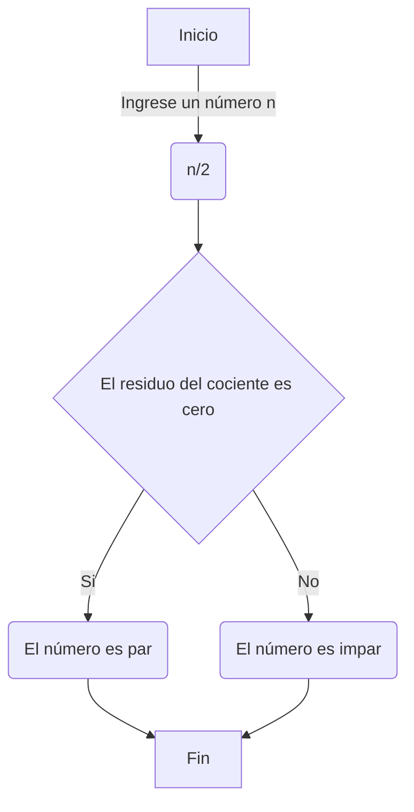

# Reto 7
| Nombre                 | Identificación | Grupo | Trabajo          |
|------------------------|----------------|-------|------------------|
| Angélica Pascagaza Vega| 1031652163     |   5   | Trabajo individual |

## Solución del reto
<table cellspacing="1" bgcolor="" align="center">
  <tr bgcolor="#252582">
    <th><b>Taller 1 - Parte 1</b></th>
  </tr>
  <tr bgcolor="#e4e4ed">
    <td style="color:#141414" align="center">Imprimir un listado con los números del 1 al 100 cada uno con su respectivo cuadrado.</td>
  </tr>
  <tr bgcolor="#e4e4ed">
    <td style="color:#141414" align="center">En esta ocasión, se utilizó el ciclo while para generar un bucle que imprimiera los números del 1 al 100 con sus respectivos cuadrados.</td>
  </tr>
</table>

**Parte 1**
```python
#RETO 7 - Punto 1
#Imprimir un listado con los números del 1 al 100 cada uno con su respectivo cuadrado.

n : int = 1

if __name__ == "_main_":
    print("Números del 1 al 100 con su respectivo cuadrado.")

    while n <= 100:
        m : int = n**2
        print(str(n) , str(m))
        n += 1

# ! /\|=\/
```

<table cellspacing="1" bgcolor="" align="center">
  <tr bgcolor="#252582">
    <th><b>Taller 1 - Parte 2</b></th>
  </tr>
  <tr bgcolor="#e4e4ed">
    <td style="color:#141414" align="center">Imprimir un listado con los números impares desde 1 hasta 999 y seguidamente otro listado con los números pares desde 2 hasta 1000.</td>
  </tr>
  <tr bgcolor="#e4e4ed">
    <td style="color:#141414" align="center">Para este ejercicio, se utilizaron dos ciclos <i>while</i>, el primero para imprimir los números impares y el segundo para los números pares.</td>
  </tr>
</table>

**Parte 2**
```python
#RETO 7 - Punto 2
#Imprimir un listado con los números impares desde 1 hasta 999 y seguidamente otro listado con los números pares desde 2 hasta 1000.

n : int = 1
m : int = 2

if __name__ == "_main_":
    print("Números impares del 1 al 999")
    while n <= 999:
        print(str(n))
        n += 2

    print("Números pares del 2 al 1000")

    while m <= 1000:
        print(str(m))
        m += 2

# ! /\|=\/
```

<table cellspacing="1" bgcolor="" align="center">
  <tr bgcolor="#252582">
    <th><b>Taller 1 - Parte 3</b></th>
  </tr>
  <tr bgcolor="#e4e4ed">
    <td style="color:#141414" align="center">Imprimir los números pares en forma descendente hasta 2 que son menores o iguales a un número natural n ≥ 2 dado</td>
  </tr>
  <tr bgcolor="#e4e4ed">
    <td style="color:#141414" align="center">En esta ocasión, se hace uso de un ciclo while</td>
  </tr>
</table>



**Parte 3**
```python
#RETO 7 - Punto 3
#Imprimir los números pares en forma descendente hasta 2 que son menores o iguales a un número natural n ≥ 2 dado

def introducir():
    n : int = int(input("Introduzca un numero natural mayor o igual a 2: "))
    desarrollo(n)

def desarrollo(n):
    while n>=2:
        if n%2==0:
            print(str(n))
            n -=2
        else:
            n = n-1

def continuar():
    opcion : int = int(input("¿Desea continuar? Marque 1 (sí) o 2 (no): "))
    return opcion

if __name__ == "_main_":
    print("Ingrese un número natural para obtener los números pares descendentes hasta 2")

    while True:
        introducir()
        opcion = continuar()
        if opcion == 2:
            break
        elif opcion != 1 and 2:
            print("Sintax error")
            break

# ! /\|=\/
```

<table cellspacing="1" bgcolor="" align="center">
  <tr bgcolor="#252582">
    <th><b>Taller 1 - Parte 4</b></th>
  </tr>
  <tr bgcolor="#e4e4ed">
    <td style="color:#141414" align="center">Realice un programa que lea dos números reales y determine si el primero es múltiplo del segundo.</td>
  </tr>
  <tr bgcolor="#e4e4ed">
    <td style="color:#141414" align="center">Para este punto, se comprueba que el primer número no es 0, para después continuar con el uso del operador del número para calcular el residuo de la división del primer número por el segundo, puesto que si el residuo de <i>num1 / num2</i> no es cero, entonces <i>num1</i> no es múltiplo de <i>num2</i>.</td>
  </tr>
</table>

**Parte 4**
```python
#Reto 7 - Punto 4
#En 2022 el país A tendrá una población de 25 millones de habitantes y el país B de 18.9 millones. Las tasas de crecimiento anual de la población serán de 2% y 3% respectivamente. Desarrollar un algoritmo para informar en que año la población del país B superará a la de A.

a = 25000000
b = 18900000
año = 2022

while b <= a:
    a = a + (a * 0.02)
    b = b + (b * 0.03)
    año = año + 1

print(f"El año en el que la población del país B será mayor que la del país A es: {año}")

# ! /\|=\/
```

<table cellspacing="1" bgcolor="" align="center">
  <tr bgcolor="#252582">
    <th><b>Taller 1 - Parte 5</b></th>
  </tr>
  <tr bgcolor="#e4e4ed">
    <td style="color:#141414" align="center">Realice un programa que lea tres números reales y determine si la suma de los dos primeros es mayor, menor o igual que el tercer número.</td>
  </tr>
  <tr bgcolor="#e4e4ed">
    <td style="color:#141414" align="center">Para el quinto punto del taller, se emplean diferentes desigualdades en las que se tiene en que se tiene en cuenta el orden en que se ingresan los datos.</td>
  </tr>
</table>

**Parte 5** 
```python
#RETO 7 - Punto 5
#Imprimir el factorial de un número natural n dado.

def introducir():
    numero : int = int(input("Introduzca un numero natural para imprimir el factorial. Ejemplo: 5: "))
    desarrollo(numero)

def desarrollo(numero):
    n : int = numero
    factorial : int = 1
    if n == 0:
        print("El factorial de 0 es 1")
        return
    while n>1:
        factorial *= n
        n -=1
    print(f"El factorial de {numero} es {factorial}")

def continuar():
    opcion : int = int(input("¿Desea continuar? Marque 1 (sí) o 2 (no): "))
    return opcion

if __name__ == "__main__":
    print("Programa para determinar el factorial de un número dado")

    while True:
        introducir()
        opcion = continuar()
        if opcion == 2:
            break
        elif opcion != 1 and 2:
            print("Sintax error")
            break

# ! /\|=\/
```

<table cellspacing="1" bgcolor="" align="center">
  <tr bgcolor="#252582">
    <th><b>Taller 1 - Parte 6</b></th>
  </tr>
  <tr bgcolor="#e4e4ed">
    <td style="color:#141414" align="center">Escriba un programa que solicite al usuario una letra y determine si es una vocal o una consonante.</td>
  </tr>
  <tr bgcolor="#e4e4ed">
    <td style="color:#141414" align="center">Para este ejercicio, se parte de la lista de vocales y luego se hace uso de condicionales para determinar si la letra está dentro de esa lista o no, en caso de no estarlo sería una consonante.</td>
  </tr>
</table>

**Parte 6** 
```python
#RETO 7 - Punto 6
#Implementar un algoritmo que permita adivinar un número dado de 1 a 100, preguntando en cada caso si el número es mayor, menor o igual.
import random

def introducir():
    adivinar : int = random.randint(1,100)
    print("Adivina el número")
    adivinar_numero(adivinar)

def adivinar_numero(adivinar):
    numero = int(input("Ingresa un numero entero: "))
    intentos : int = 1
    while numero != adivinar:
        if numero < adivinar:
            print("Buen intento, pero el número es mayor.")
            numero = int(input("Ingresa otro número: "))
            intentos +=1
            continue
        elif numero > adivinar:
            print("Buen intento, pero el número es menor.")
            numero = int(input("Ingresa otro número: "))
            intentos +=1
            continue
    print(f"¡Felicitaciones! Adivinaste el número {adivinar} en {intentos} intentos.")
            

def continuar():
    opcion = int(input("¿Desea continuar? Marque 1 (sí) o 2 (no): "))
    return opcion

if __name__ == "__main__":
    print("Bienvenido, adivina un número entre 1 y 100.")

    while True:
        introducir()
        opcion = continuar()
        if opcion == 2:
            break
        elif opcion != 1 and 2:
            print("Error de sintaxis")
            break

# ! /\|=\/
```

<table cellspacing="1" bgcolor="" align="center">
  <tr bgcolor="#252582">
    <th><b>Taller 1 - Parte 7</b></th>
  </tr>
  <tr bgcolor="#e4e4ed">
  <td style="color:#141414" align="center">Escriba un programa que pida 5 números reales y calcule las siguientes operaciones:
        <li>El promedio</li>
        <li>La mediana</li>
        <li>El promedio multiplicativo </li>
        <li>Ordenar los números de forma ascendente</li>
        <li>Ordenar los números de forma descendente</li>
        <li>La potencia del mayor número elevado al menor número</li>
        <li>La raíz cúbica del menor número</li>
   </td>
  </tr>
  <tr bgcolor="#e4e4ed">
    <td style="color:#141414" align="center">Para este punto, primero se ordenan los números de forma ascendente en una lista a partir de una función propia <i>ordenar_numeros</i>, y desde ahí se van ejecutando las operaciones correspondientes.</td>
  </tr>
</table>

**Parte 7** 
```python
#RETO 7 - Punto 7
#Implementar un programa que ingrese un número de 2 a 50 y muestre sus divisores.

def introducir():
    numero : int = int(input("Introduzca un numero entre 2 y 50 para conocer sus divisores. Ejemplo: 5: "))
    desarrollo(numero)

def desarrollo(numero):
    if numero <2 or numero > 50:
        print(f"{numero} no está en el rango")
        continuar()
    else:
        print(f"Los divisores de {numero} son:")
        n : int = numero
        while n>0:
            if numero%n == 0:
                print(str(n))
                n -= 1
                continue
            else:
                n -=1
                continue
        return

def continuar():
    opcion : int = int(input("¿Desea continuar? Marque 1 (sí) o 2 (no): "))
    return opcion

if __name__ == "__main__":
    print("Programa para conocer los divisores de un número entre 2 y 50")

    while True:
        introducir()
        opcion = continuar()
        if opcion == 2:
            break
        elif opcion != 1 and 2:
            print("Sintax error")
            break

# ! /\|=\/
```

<table cellspacing="1" bgcolor="" align="center">
  <tr bgcolor="#252582">
    <th><b>Taller 1 - Parte 8</b></th>
  </tr>
  <tr bgcolor="#e4e4ed">
    <td style="color:#141414" align="center">Escriba un programa al que se le ingrese la frecuencia de una onda en hz y como salida arroje en que parte del espectro electromagnético se encuentra.</td>
  </tr>
  <tr bgcolor="#e4e4ed">
    <td style="color:#141414" align="center">En esta ocasión, se investigó sobre el espectro electromagnético para después generar desigualdades que permitan determinar en qué parte del espectro electromagnético se encuentra la onda.</td>
  </tr>
</table>

**Parte 8** 
```python
#RETO 7 - Punto 8
#Implementar el algoritmo que muestre los números primos del 1 al 100. Nota: use funciones
primos : list = [2, 3, 5, 7, 11, 13, 17, 19, 23, 29, 31, 37, 41, 43, 47, 53, 59, 61, 67, 71, 73, 79, 83, 89, 97]
n: int = 0
def numero_primo(primos,n):
    while n<=24:
        print(primos[n])
        n+=1
    return

if __name__ == "__main__":
    print("Programa para conocer los numero primos del 1 al 100:")
    numero_primo(primos,n)

# ! /\|=\/
```

<h2>Bibliografía</h2>
    <div class="bibliografia">
        <table>
            <tr>
                <th>Referencia</th>
            </tr>
            <tr>
                <td>Car and Driver. (2024, febrero 26). Los 20 coches más rápidos del mundo y su velocidad máxima. Recuperado de https://www.caranddriver.com/es/coches/planeta-motor/g38887240/coches-mas-rapidos-mundo/<a href="https://www.caranddriver.com/es/coches/planeta-motor/g38887240/coches-mas-rapidos-mundo/"></a></td>
            </tr>
            <tr>
                <td>Women's Health. (2024, febrero 19). ¿A qué ritmo deberíamos comenzar a correr para lograr después una gran velocidad? Recuperado de https://www.womenshealthmag.com/es/fitness/a2000480/velocidad-corren-humanos/<a href="https://www.womenshealthmag.com/es/fitness/a2000480/velocidad-corren-humanos/"></a></td>
            </tr> 
          <tr>
                <td>Pythonspot. (2023, noviembre 26). Python Tests / Quizes. Recuperado de https://pythonspot.com/python-tests-quizes/<a href="https://pythonspot.com/python-tests-quizes/"></a></td>
            </tr> 
          <tr>
                <td>Mundo Deportivo. (s.f.). Lista de países y capitales de América. Recuperado de https://www.mundodeportivo.com/uncomo/educacion/articulo/lista-de-paises-y-capitales-de-america-42870.html<a href="https://www.mundodeportivo.com/uncomo/educacion/articulo/lista-de-paises-y-capitales-de-america-42870.html"></a></td>
          </tr>
          <tr>
                <td>Concepto. (2024, febrero 18). Espectro Electromagnético - Concepto, regiones, usos e importancia. Recuperado de https://concepto.de/espectro-electromagnetico/<a href="https://concepto.de/espectro-electromagnetico/"></a></td>
          </tr>              
        </table>
    </div>
