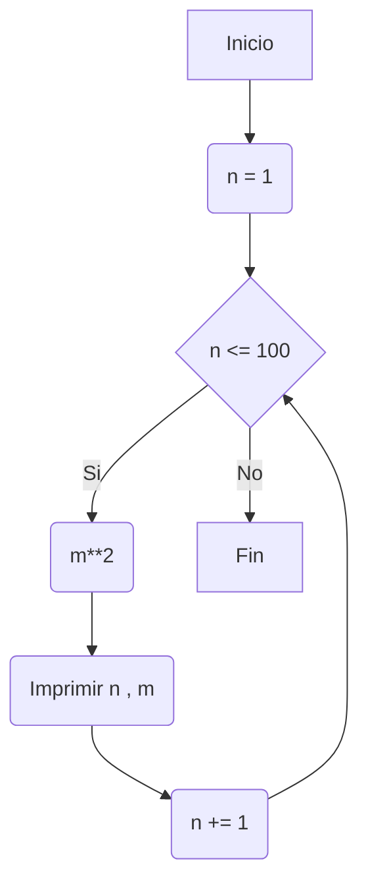
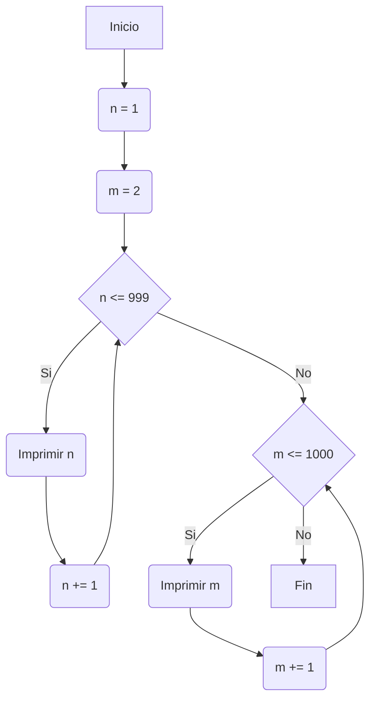
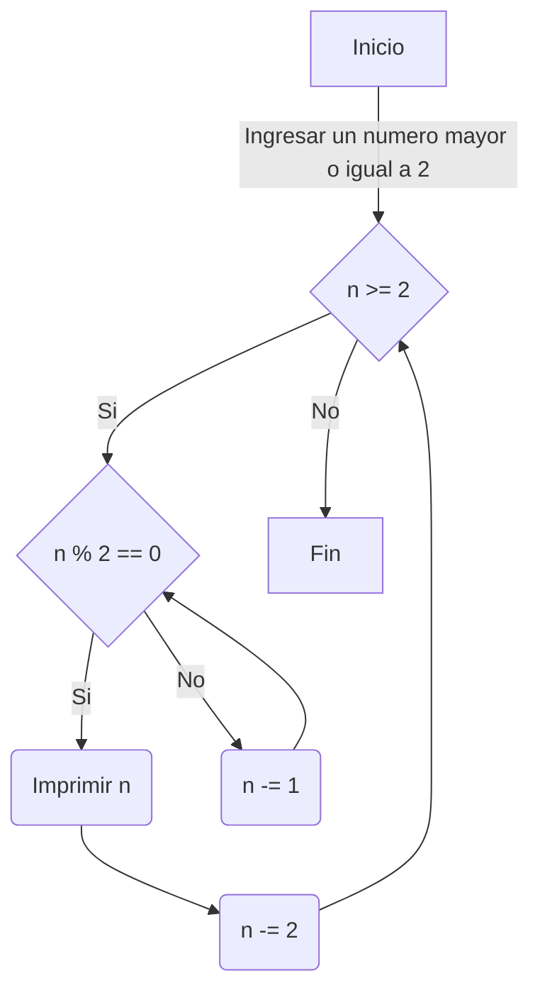

# Reto 7
| Nombre                 | Identificación | Grupo | Trabajo          |
|------------------------|----------------|-------|------------------|
| Angélica Pascagaza Vega| 1031652163     |   5   | Trabajo individual |

## Solución del reto
<table cellspacing="1" bgcolor="" align="center">
  <tr bgcolor="#252582">
    <th><b>Reto 7 - Parte 1</b></th>
  </tr>
  <tr bgcolor="#e4e4ed">
    <td style="color:#141414" align="center">Imprimir un listado con los números del 1 al 100 cada uno con su respectivo cuadrado.</td>
  </tr>
  <tr bgcolor="#e4e4ed">
    <td style="color:#141414" align="center">En esta ocasión, se utilizó el ciclo while para generar un bucle que imprimiera los números del 1 al 100 con sus respectivos cuadrados.</td>
  </tr>
</table>



**Parte 1**
```python
#RETO 7 - Punto 1
#Imprimir un listado con los números del 1 al 100 cada uno con su respectivo cuadrado.

n : int = 1

if __name__ == "_main_":
    print("Números del 1 al 100 con su respectivo cuadrado.")

    while n <= 100:
        m : int = n**2
        print(str(n) , str(m))
        n += 1

# ! /\|=\/
```

<table cellspacing="1" bgcolor="" align="center">
  <tr bgcolor="#252582">
    <th><b>Reto 7 - Parte 2</b></th>
  </tr>
  <tr bgcolor="#e4e4ed">
    <td style="color:#141414" align="center">Imprimir un listado con los números impares desde 1 hasta 999 y seguidamente otro listado con los números pares desde 2 hasta 1000.</td>
  </tr>
  <tr bgcolor="#e4e4ed">
    <td style="color:#141414" align="center">Para este ejercicio, se utilizaron dos ciclos <i>while</i>, el primero para imprimir los números impares y el segundo para los números pares.</td>
  </tr>
</table>



**Parte 2**
```python
#RETO 7 - Punto 2
#Imprimir un listado con los números impares desde 1 hasta 999 y seguidamente otro listado con los números pares desde 2 hasta 1000.

n : int = 1
m : int = 2

if __name__ == "_main_":
    print("Números impares del 1 al 999")
    while n <= 999:
        print(str(n))
        n += 2

    print("Números pares del 2 al 1000")

    while m <= 1000:
        print(str(m))
        m += 2

# ! /\|=\/
```

<table cellspacing="1" bgcolor="" align="center">
  <tr bgcolor="#252582">
    <th><b>Reto 7 - Parte 3</b></th>
  </tr>
  <tr bgcolor="#e4e4ed">
    <td style="color:#141414" align="center">Imprimir los números pares en forma descendente hasta 2 que son menores o iguales a un número natural n ≥ 2 dado</td>
  </tr>
  <tr bgcolor="#e4e4ed">
    <td style="color:#141414" align="center">En esta ocasión, se hace uso de un ciclo <i>while</i> para determinar los números pares menor a cierto número.</td>
  </tr>
</table>



**Parte 3**
```python
#RETO 7 - Punto 3
#Imprimir los números pares en forma descendente hasta 2 que son menores o iguales a un número natural n ≥ 2 dado

def introducir():
    n : int = int(input("Introduzca un numero natural mayor o igual a 2: "))
    desarrollo(n)

def desarrollo(n):
    while n>=2:
        if n%2==0:
            print(str(n))
            n -=2
        else:
            n = n-1

def continuar():
    opcion : int = int(input("¿Desea continuar? Marque 1 (sí) o 2 (no): "))
    return opcion

if __name__ == "_main_":
    print("Ingrese un número natural para obtener los números pares descendentes hasta 2")

    while True:
        introducir()
        opcion = continuar()
        if opcion == 2:
            break
        elif opcion != 1 and 2:
            print("Sintax error")
            break

# ! /\|=\/
```

<table cellspacing="1" bgcolor="" align="center">
  <tr bgcolor="#252582">
    <th><b>Reto 7 - Parte 4</b></th>
  </tr>
  <tr bgcolor="#e4e4ed">
    <td style="color:#141414" align="center">En 2022 el país A tendrá una población de 25 millones de habitantes y el país B de 18.9 millones. Las tasas de crecimiento anual de la población serán de 2% y 3% respectivamente. Desarrollar un algoritmo para informar en que año la población del país B superará a la de A.</td>
  </tr>
  <tr bgcolor="#e4e4ed">
    <td style="color:#141414" align="center">Para este punto, se plantea el ciclo <i>while</i> para ir aumentando las poblaciones (a sus debidas proporciones) para que al momento de que la población B sea mayor que la población A se imprima el año del suceso.</td>
  </tr>
</table>

**Parte 4**
```python
#Reto 7 - Punto 4
#En 2022 el país A tendrá una población de 25 millones de habitantes y el país B de 18.9 millones. Las tasas de crecimiento anual de la población serán de 2% y 3% respectivamente. Desarrollar un algoritmo para informar en que año la población del país B superará a la de A.

a = 25000000
b = 18900000
año = 2022

while b <= a:
    a = a + (a * 0.02)
    b = b + (b * 0.03)
    año = año + 1

print(f"El año en el que la población del país B será mayor que la del país A es: {año}")

# ! /\|=\/
```

<table cellspacing="1" bgcolor="" align="center">
  <tr bgcolor="#252582">
    <th><b>Reto 7 - Parte 5</b></th>
  </tr>
  <tr bgcolor="#e4e4ed">
    <td style="color:#141414" align="center">Imprimir el factorial de un número natural n dado.</td>
  </tr>
  <tr bgcolor="#e4e4ed">
    <td style="color:#141414" align="center">Para el quinto punto del reto, se emplea el ciclo <i>while</i> para multiplicar el número por los anteriores.</td>
  </tr>
</table>

**Parte 5** 
```python
#RETO 7 - Punto 5
#Imprimir el factorial de un número natural n dado.

def introducir():
    numero : int = int(input("Introduzca un numero natural para imprimir el factorial. Ejemplo: 5: "))
    desarrollo(numero)

def desarrollo(numero):
    n : int = numero
    factorial : int = 1
    if n == 0:
        print("El factorial de 0 es 1")
        return
    while n>1:
        factorial *= n
        n -=1
    print(f"El factorial de {numero} es {factorial}")

def continuar():
    opcion : int = int(input("¿Desea continuar? Marque 1 (sí) o 2 (no): "))
    return opcion

if __name__ == "__main__":
    print("Programa para determinar el factorial de un número dado")

    while True:
        introducir()
        opcion = continuar()
        if opcion == 2:
            break
        elif opcion != 1 and 2:
            print("Sintax error")
            break

# ! /\|=\/
```

<table cellspacing="1" bgcolor="" align="center">
  <tr bgcolor="#252582">
    <th><b>Reto 7 - Parte 6</b></th>
  </tr>
  <tr bgcolor="#e4e4ed">
    <td style="color:#141414" align="center">Implementar un algoritmo que permita adivinar un número dado de 1 a 100, preguntando en cada caso si el número es mayor, menor o igual.</td>
  </tr>
  <tr bgcolor="#e4e4ed">
    <td style="color:#141414" align="center">Para este ejercicio, únicamente se utilizan condicionales para determinar si el número era mayor o menor e ir ayudando al usuario a adivinarlo.</td>
  </tr>
</table>

**Parte 6** 
```python
#RETO 7 - Punto 6
#Implementar un algoritmo que permita adivinar un número dado de 1 a 100, preguntando en cada caso si el número es mayor, menor o igual.
import random

def introducir():
    adivinar : int = random.randint(1,100)
    print("Adivina el número")
    adivinar_numero(adivinar)

def adivinar_numero(adivinar):
    numero = int(input("Ingresa un numero entero: "))
    intentos : int = 1
    while numero != adivinar:
        if numero < adivinar:
            print("Buen intento, pero el número es mayor.")
            numero = int(input("Ingresa otro número: "))
            intentos +=1
            continue
        elif numero > adivinar:
            print("Buen intento, pero el número es menor.")
            numero = int(input("Ingresa otro número: "))
            intentos +=1
            continue
    print(f"¡Felicitaciones! Adivinaste el número {adivinar} en {intentos} intentos.")
            

def continuar():
    opcion = int(input("¿Desea continuar? Marque 1 (sí) o 2 (no): "))
    return opcion

if __name__ == "__main__":
    print("Bienvenido, adivina un número entre 1 y 100.")

    while True:
        introducir()
        opcion = continuar()
        if opcion == 2:
            break
        elif opcion != 1 and 2:
            print("Error de sintaxis")
            break

# ! /\|=\/
```

<table cellspacing="1" bgcolor="" align="center">
  <tr bgcolor="#252582">
    <th><b>Reto 7 - Parte 7</b></th>
  </tr>
  <tr bgcolor="#e4e4ed">
  <td style="color:#141414" align="center">Implementar un programa que ingrese un número de 2 a 50 y muestre sus divisores.</td>
  </tr>
  <tr bgcolor="#e4e4ed">
    <td style="color:#141414" align="center">Para este punto, se definió una función para introducir un número que estuviera en el intervalo [2,50] y luego se utilizaron condicionales acompañados del ciclo <i>while</i> para determinar los divisores del número.</td>
  </tr>
</table>

**Parte 7** 
```python
#RETO 7 - Punto 7
#Implementar un programa que ingrese un número de 2 a 50 y muestre sus divisores.

def introducir():
    numero : int = int(input("Introduzca un numero entre 2 y 50 para conocer sus divisores. Ejemplo: 5: "))
    desarrollo(numero)

def desarrollo(numero):
    if numero <2 or numero > 50:
        print(f"{numero} no está en el rango")
        continuar()
    else:
        print(f"Los divisores de {numero} son:")
        n : int = numero
        while n>0:
            if numero%n == 0:
                print(str(n))
                n -= 1
                continue
            else:
                n -=1
                continue
        return

def continuar():
    opcion : int = int(input("¿Desea continuar? Marque 1 (sí) o 2 (no): "))
    return opcion

if __name__ == "__main__":
    print("Programa para conocer los divisores de un número entre 2 y 50")

    while True:
        introducir()
        opcion = continuar()
        if opcion == 2:
            break
        elif opcion != 1 and 2:
            print("Sintax error")
            break

# ! /\|=\/
```

<table cellspacing="1" bgcolor="" align="center">
  <tr bgcolor="#252582">
    <th><b>Reto 7 - Parte 8</b></th>
  </tr>
  <tr bgcolor="#e4e4ed">
    <td style="color:#141414" align="center">Implementar el algoritmo que muestre los números primos del 1 al 100. Nota: use funciones.</td>
  </tr>
  <tr bgcolor="#e4e4ed">
    <td style="color:#141414" align="center">En esta ocasión, se partió de una lista de los números primos existentes en el intervalo [1,100] y luego se utilizó el ciclo <i>while</i> para imprimir la lista.</td>
  </tr>
</table>

**Parte 8** 
```python
#RETO 7 - Punto 8
#Implementar el algoritmo que muestre los números primos del 1 al 100. Nota: use funciones
primos : list = [2, 3, 5, 7, 11, 13, 17, 19, 23, 29, 31, 37, 41, 43, 47, 53, 59, 61, 67, 71, 73, 79, 83, 89, 97]
n: int = 0
def numero_primo(primos,n):
    while n<=24:
        print(primos[n])
        n+=1
    return

if __name__ == "__main__":
    print("Programa para conocer los numero primos del 1 al 100:")
    numero_primo(primos,n)

# ! /\|=\/
```
